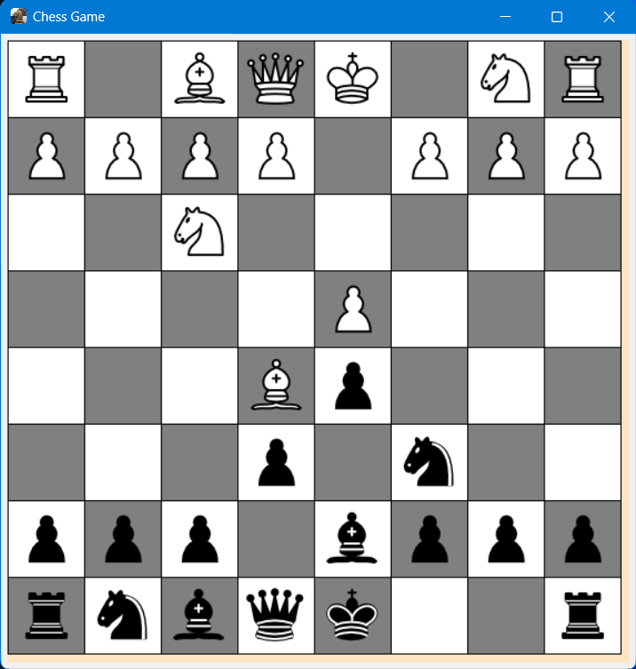

Welcome to the Python Chess Game!

This is a simple chess game for two players to play on the same computer. 
To start a game, run the "chess.py" file. 

The game is played using standard chess rules and the chessboard displays the current state of the game.

Have fun!
